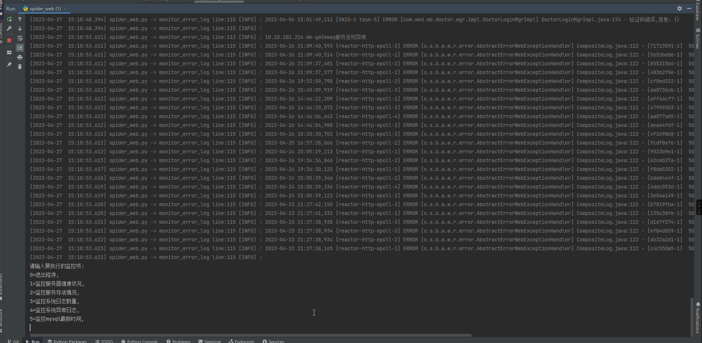
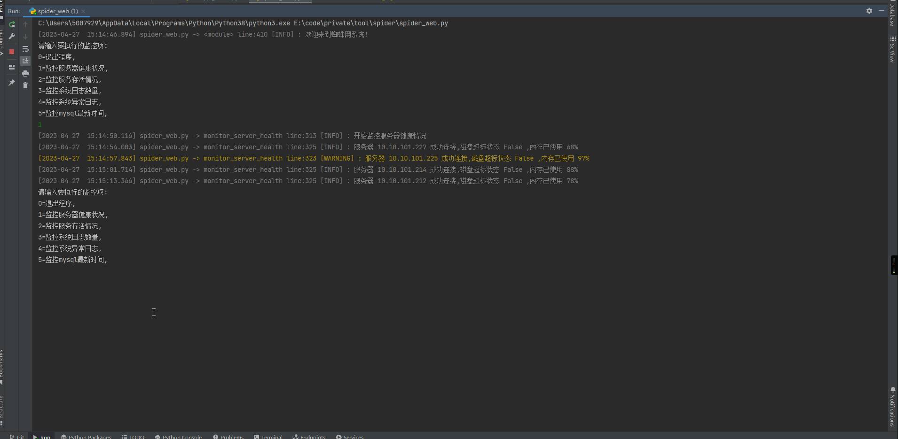
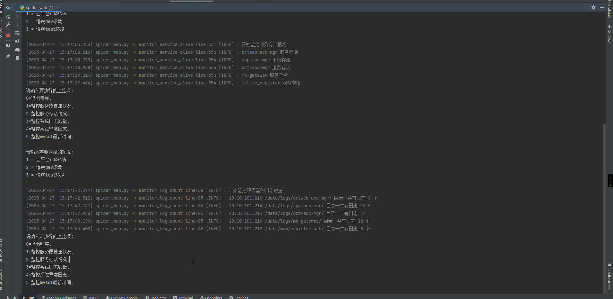
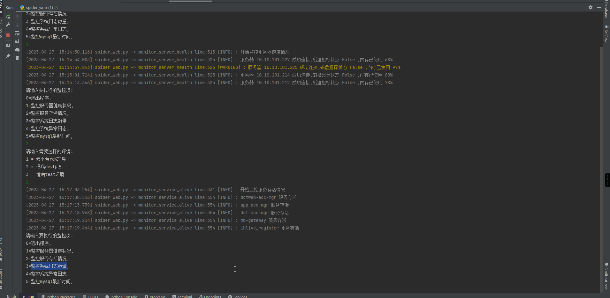

#### 蜘蛛网系统  
独立于平台监控外的一个通用监控，用于监控如下方面
- 服务器开机，磁盘，内存情况
- 服务是否正常存活
- 系统日志数量
- 系统异常日志，针对具体业务进行细化开发
- 服务器数据库相关表的最新创建时间/更新时间/其他时间监控  
##### 依赖环境
python：3.8.10  
Logbook：1.5.3  
colorlog：6.7.0  
pandas：1.4.2  
paramiko：2.10.3  
PyMySQL：1.0.2  
无需二次开发，只需要将对应的配置文件配置好即可，具体配置及说明如下：
##### env.txt  
用途：主要用来区分不同项目的不同环境，配置后可能动态生成在可选列表中  
配置内容（一定要用制表符隔开）从前到后依次是  
- 序号（不可重复）
- 环境名称昵称
- 环境（冒号隔开，前面是项目名称，后面是具体的环境名称）  
##### mysql_latest_time.txt 
用途：用于简单的带时间的业务监控，比如想知道今天某个环境是否有用户登录，设备上报数据等等  
配置内容（一定要用制表符隔开）从前到后依次是  
- 数据库名
- 表名
- 时间字段
- 项目名称
- 环境名称
##### mysql_pass.txt 
用途：存放mysql的数据库账号密码  
配置内容（一定要用制表符隔开）从前到后依次是  
- 项目名称
- 环境名称
- 数据库ip地址
- 端口
- 账号
- 密码
##### mysql_sql.txt 
用途：通用的mysql查询语句配置文件  
配置内容（一定要用制表符隔开）从前到后依次是  
- sql唯一标识
- 环境名称
- 具体的sql
##### server_log.txt 
用途：可以进行业务相关的监控，比如可以监控服务是否存活，是否有打印过多日志并以此推断出更多的问题，比如程序疯狂死循环，  
设备疯狂发消息，或者黑客疯狂调接口之类的。还可以监控异常的日志，可以提前在代码中埋好点打印异常业务日志，  
遇到需要关注的异常可以第一时间捕捉到，无需手动一台一台去查看每一台服务器每一个服务的异常日志  
配置内容（一定要用制表符隔开）从前到后依次是  
- 服务器ip地址
- 日志所在的目录
- 日志名称
- 服务名称
- 项目名称
- 环境名称
##### server_pass.txt 
用途：可以监控服务器的一些硬件指标，避免内存超标，硬盘爆了之类的    
配置内容（一定要用制表符隔开）从前到后依次是  
- 服务器ip地址
- 账号
- 密码
#### 蜘蛛网系统演示
- 监控mysql最新时间.gif

- 监控服务器健康状况.gif

- 监控服务存活情况.gif

- 监控系统异常日志.gif

- 监控系统日志数量.gif

